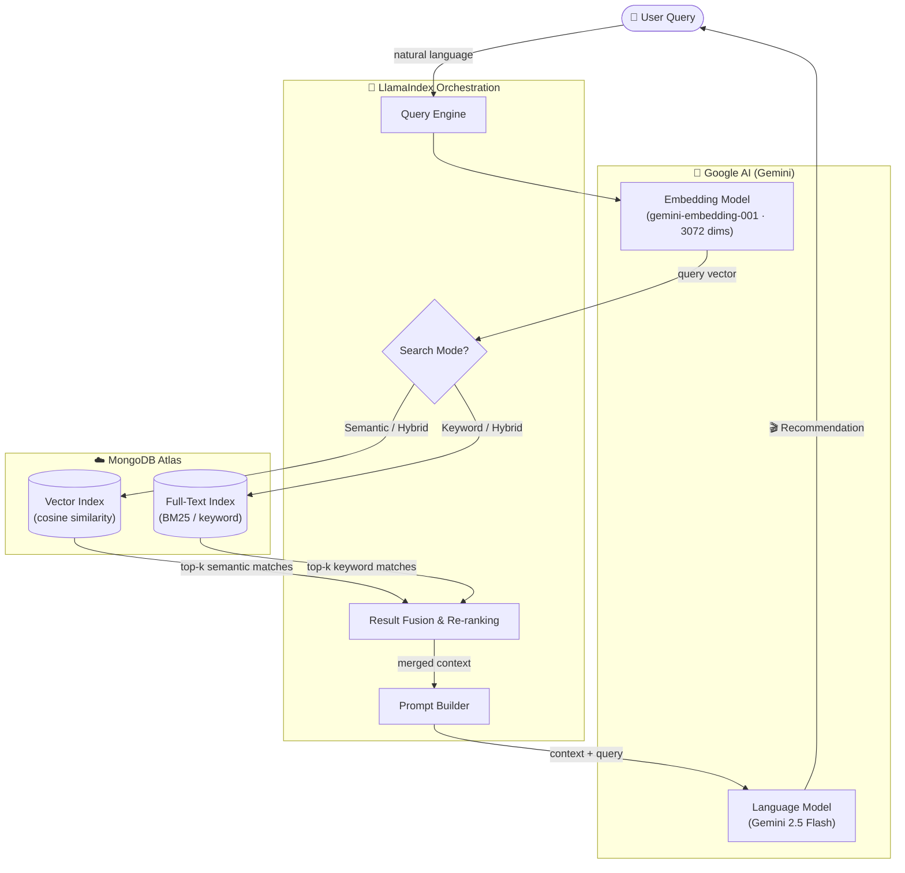
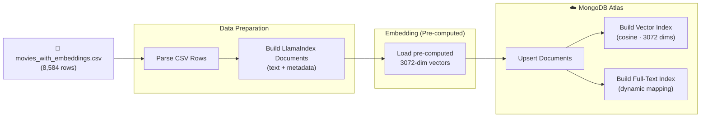

# Architecture Overview

This project is built on a modern AI-orchestration stack. The system operates on **two separate pipelines**:
the **Ingestion Pipeline** (runs once to build the database) and the **Query Pipeline** (runs on every user request).

---

## End-to-End Pipeline

The diagram below shows the complete request lifecycle — from a user typing a query, through retrieval, to a final recommendation.

<Callout type="info">
  In **Hybrid** mode, both the Vector Index and Full-Text Index are queried simultaneously. An **Alpha** parameter (0.0–1.0) controls the weight of semantic vs. keyword results before they are merged.
</Callout>

---

## Ingestion Pipeline

This pipeline runs **once upfront** to populate MongoDB Atlas with your movie library.

<Callout type="tip">
  Because embeddings are **pre-computed** and stored in the CSV, the ingestion step never calls the Gemini Embedding API — it only uploads existing vectors to Atlas, making ingestion extremely fast.
</Callout>

---

## Component Reference

### Core Stack

<Cards>
  <Card title="LlamaIndex" description="Orchestration layer. Manages document ingestion, indexing strategy, query engine construction, and prompt building." />
  <Card title="MongoDB Atlas" description="Cloud vector database. Hosts the Vector Search index (cosine) and Full-Text Search index (BM25) for hybrid retrieval." />
  <Card title="Gemini 2.5 Flash" description="The synthesis LLM. Converts retrieved movie context into coherent, readable recommendations." />
  <Card title="Gemini Embedding 001" description="Transforms text queries into 3072-dimensional vectors for semantic comparison at query time." />
</Cards>

---

## Search Mode Comparison

| Mode | Vector Index | Full-Text Index | Best For |
| :--- | :---: | :---: | :--- |
| **Semantic** (`default`) | ✔ | ✗ | "vibe" queries (*something like Inception*) |
| **Keyword** (`text_search`) | ✗ | ✔ | Exact title / actor name lookup |
| **Hybrid** (recommended) | ✔ | ✔ | Everything — balanced via Alpha |

<Callout type="info">
  **Why Cosine Similarity?** We measure the **angle** between vectors rather than the distance. For movie semantics, two films can share a concept ("heist") with very different description lengths — cosine similarity handles this correctly by ignoring vector magnitude.
</Callout>
